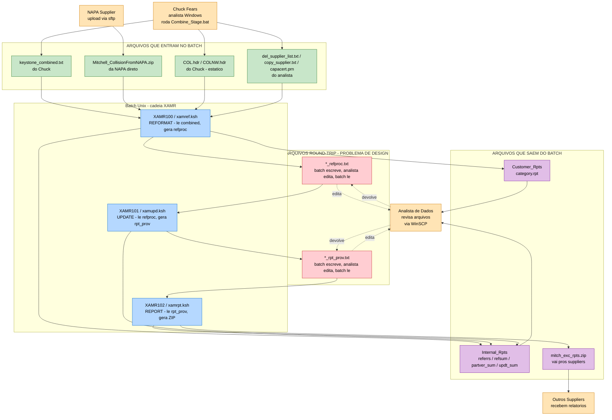
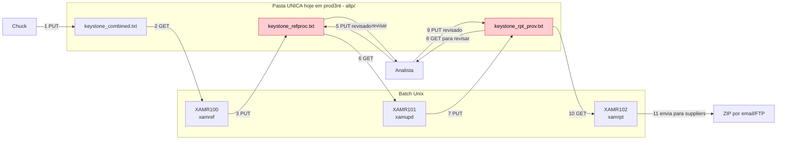
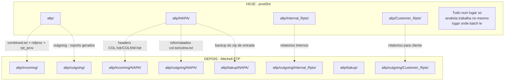
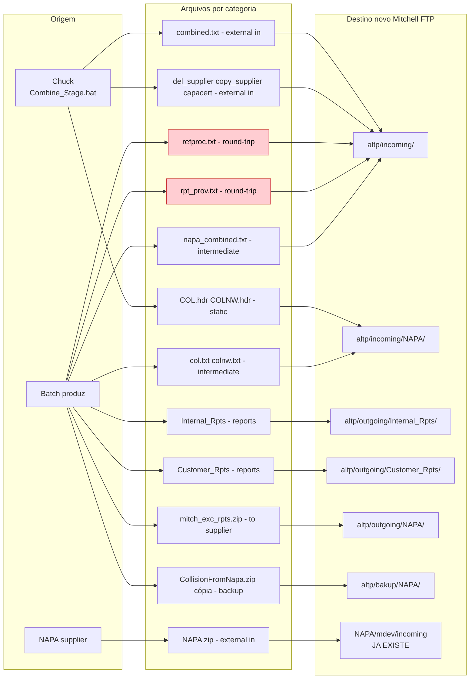
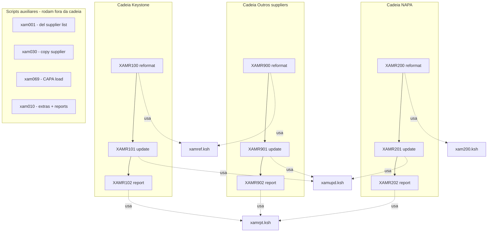

# Fluxo ALTP / MAPP — diagramas

> Atenção: nenhum diagrama usa parênteses pra evitar bug do Mermaid.

---

## 1. Visão geral — quem produz e quem consome cada arquivo

> Legenda: **laranja** = ator externo (humano/supplier), **azul** = passo do batch, **verde** = arquivo que ENTRA no batch, **vermelho** = arquivo round-trip que vai e volta (problema de design), **roxo** = arquivo que SAI do batch.

---

## 2. Detalhamento do round-trip — fluxo Keystone XAMR100 → 101 → 102

> Esse é o ponto crucial pra decidir onde colocar `_refproc.txt` e `_rpt_prov.txt` no novo modelo.

> Os arquivos em **vermelho** são os "round-trip" — escritos pelo batch, editados pelo analista no MESMO lugar, lidos de volta pelo batch.
> Hoje funciona porque tudo mora em `${NOVELL}altp` — uma pasta só.
> No modelo novo com `incoming` e `outgoing` separados, a pergunta é: **onde mora o `refproc.txt`**? Se `outgoing/`, o analista precisa mover pra `incoming/` antes do XAMR101 rodar. Se `incoming/`, o analista trabalha sempre no mesmo lugar como hoje.

---

## 3. Comparacao prod3nt HOJE vs Mitchell FTP DEPOIS

---

## 4. Mapeamento detalhado por arquivo - INTERPRETACAO B recomendada

> Interpretação B = "incoming = trabalho interno entre batch e analista, outgoing = só o que sai pra fora da Mitchell".

> Note como na Interpretação B os arquivos round-trip (vermelho) ficam em `incoming/` — mesma pasta que o Chuck escreve. Analista trabalha sempre no mesmo lugar, sem novo passo operacional.

---

## 5. Cadeia de execucao completa - todos os XAMR

> Os 3 scripts no fundo - **xamref / xamupd / xamrpt** - são a "máquina" reaproveitada pelas 3 cadeias. Ao editar esses 3, você cobre Keystone, NAPA e os outros suppliers de uma vez. Por isso o `xamref.ksh` é por onde começamos.
